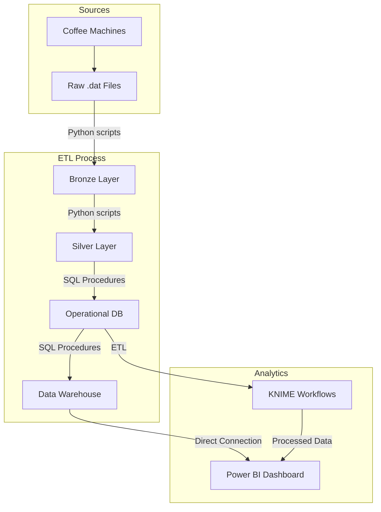

# Machine Data Processing System

## Project Overview

This project implements a comprehensive data processing pipeline for coffee machine operational data. The system follows industry best practices with a multi-stage ETL (Extract, Transform, Load) process and uses a medallion architecture pattern.

### Key Components

1. **Data Collection**: Automated extraction from coffee machines via SMB connection
2. **Data Processing Pipeline**: Bronze → Silver → Gold (Data Warehouse)
3. **Relational Database**: Structured storage of operational data
4. **Data Warehouse**: Star schema for analytical processing
5. **Analytics Integration**: Data visualization and prediction with KNIME and Power BI

## Architecture



## Directory Structure


The ETL process uses the following directory structure:

```
DataCycleProject/
│
├── EversysDatFiles/                 # Source directory for raw .dat files
│
├── BronzeRawData/                   # Bronze layer - Consolidated raw data  
│   ├── Cleaning/
│   │   ├── current/                 # Current consolidated data
│   │   │   ├── Cleaning.dat         # Main data file
│   │   │   └── cleaned_lines.txt    # Tracking file for processed lines
│   │   └── YYYY/MM/DD/              # Historical data organized by date
│   ├── Rinse/
│   │   ├── current/                 # Current consolidated data
│   │   │   ├── Rinse.dat            # Main data file
│   │   │   └── cleaned_lines.txt    # Tracking file for processed lines
│   │   └── YYYY/MM/DD/ 
│   ├── Info/
│   │   ├── current/                 # Current consolidated data
│   │   │   ├── Info.dat             # Main data file
│   │   │   └── cleaned_lines.txt    # Tracking file for processed lines
│   │   └── YYYY/MM/DD/
│   └── Product/
│   │   ├── current/                 # Current consolidated data
│   │   │   ├── Product.dat          # Main data file
│   │   │   └── cleaned_lines.txt    # Tracking file for processed lines
│   │   └── YYYY/MM/DD/ 
│
├── SilverRawData/                   # Silver layer - Cleaned and validated data
│   ├── Cleaning/
│   │   ├── current/                 # Current cleaned data
│   │   │   └── Silver_Cleaning.dat  # Main cleaned data file
│   │   └── YYYY/MM/DD/              # Historical data organized by date
│   ├── Rinse/
│   │   ├── current/                 # Current cleaned data
│   │   │   └── Silver_Rinse.dat     # Main cleaned data file
│   │   └── YYYY/MM/DD/              # Historical data organized by date
│   ├── Info/
│   │   ├── current/                 # Current cleaned data
│   │   │   └── Silver_Info.dat      # Main cleaned data file
│   │   └── YYYY/MM/DD/              # Historical data organized by date
│   └── Product/
│   │   ├── current/                 # Current cleaned data
│   │   │   └── Silver_Product.dat   # Main cleaned data file
│   │   └── YYYY/MM/DD/              # Historical data organized by date
│
├── TempDatFiles/                    # Temporary processing directory
│
├── processed_files.txt              # Tracker file for processed source files
│
└── scripts/                         # Python processing scripts
    ├── bronze_processor.py          # Bronze layer ETL
    ├── silver_cleaning.py           # Silver layer ETL for cleaning data
    ├── silver_info.py               # Silver layer ETL for info messages
    └── silver_rinse.py              # Silver layer ETL for rinse operations
```

## Database Architecture

### Operational Database (machine_data)

The operational database stores the raw cleaned data from coffee machines in a normalized structure.


### Data Warehouse (DWmachines)

The data warehouse implements a star schema optimized for analytical queries:

- **Dimension Tables**: Store descriptive attributes (DimMachine, DimDate, DimTime, etc.)
- **Fact Tables**: Store measurements with foreign keys to dimensions (FactMachineCleaning, FactRinseOperation, etc.)


## ETL Process

The ETL process is fully automated and consists of the following steps:

1. **Raw Data Download**: Python script connects to SMB server and downloads .dat files
2. **Bronze Layer**: Files are consolidated by category
3. **Silver Layer**: Data is validated, cleaned, and standardized  
4. **Operational DB**: Data is imported into relational tables
5. **Data Warehouse**: Dimensional model is populated from operational data

## Automation

The system is fully automated through:

1. **GitHub Actions**: 
   - "Execute Eversys Scripts" (runs every 30 minutes) - Executes Python ETL scripts
   - "Deploy on VM" (runs on code changes) - Updates code on production VM

2. **SQL Server Agent Jobs**:
   - Import jobs for each log type
   - Master import job to run all procedures
   - Data warehouse ETL job
   - Database backup job

## Analytics

### KNIME Integration
The data from the Data Warehouse is imported into KNIME workflows for advanced analytics, including:

- Machine performance analysis
- Predictive algorithms
- Usage pattern identification

The predictive workflow was developed with KNIME and published on KNIME Server as a REST API service, enabling direct integration with external systems (e.g. Power BI) and inference automation. The architecture adopted separates the data preparation phase from the predictive phase, ensuring modularity and control:

- A separate workflow or SQL script queries the Data Warehouse (DWmachines), processes the data and populates an intermediate table containing the aggregated and filtered data needed for inference. The workflow is also used to test different models and train the chosen one.
- The workflow published on KNIME Server uses a Container Input (Table) node to receive this input data, reading directly from the generated table.
- Within the workflow, the data undergoes a preprocessing phase, then is passed to a multiple regression model capable of simulating a Recurrent Neural Network to estimate multiple target values and identify patterns.
- The model results are passed to a Container Output (Table), allowing:

  - the return of data via API in tabular format,
  - or writing to a file or output table in the database, accessible by business intelligence tools such as Power BI.

This configuration allows you to:

- perform inferences on always up-to-date data (thanks to the table prepared upstream),
- call the model via API when needed,
- easily integrate forecasts into the analytics dashboard.

### Power BI Dashboard


A Power BI dashboard provides visualization of key metrics and KPIs:

- Machine cleaning effectiveness
- Product popularity by type
- Operational efficiency
- Maintenance scheduling
- Quality metrics
- Prediction of machines maintenance
- Prediction of product consumption

## Setup and Configuration

### Prerequisites

- SQL Server 2019 or newer
- SQL Server Agent 
- Python 3.9+
- Required Python packages: pandas, smbprotocol
- KNIME Analytics Platform 
- Power BI Desktop

### Installation

1. Create the database and tables:
```sql
-- Create the database
CREATE DATABASE [machine_data]
GO
```

2. Set up the directory structure:
```
mkdir -p EversysDatFiles
mkdir -p BronzeRawData/Cleaning/current
mkdir -p BronzeRawData/Rinse/current 
mkdir -p BronzeRawData/Product/current
mkdir -p BronzeRawData/Info/current
mkdir -p SilverRawData/Cleaning/current
mkdir -p SilverRawData/Rinse/current
mkdir -p SilverRawData/Product/current
mkdir -p SilverRawData/Info/current
```

3. Deploy Python scripts:
   - Configure SMB connection parameters in downloadeversysfiles.py
   - Configure file paths in all processing scripts

4. Create and configure SQL Server Agent jobs

5. Set up GitHub Actions workflows (see how in [Github-Actions-workflows](./Technical_Documentation/Github-Actions-workflows.md))

6. Configure KNIME workflows [workflows](./Technical_Documentation/knime%20documentation/workflows.md)

7. Configure Power BI dashboard

### Configuration Files

- SMB connection parameters for data download
- File paths for data processing
- Database connection parameters
- Scheduling parameters for automation

## Maintenance

### Regular Maintenance Tasks

1. SQL Server database maintenance:
   - Index rebuilding
   - Statistics updates
   - Database backups

2. ETL Process monitoring:
   - Check GitHub Actions logs
   - Verify SQL Server Agent job history
   - Monitor ETL errors and warnings

3. Performance optimization:
   - Query performance tuning
   - ETL process optimization

## Documentation

Detailed documentation for all system components is available:

- [ETL Process Documentation](./Technical_Documentation/ETL-Process-Flow.md)
- [Github Actions Workflows](./Technical_Documentation/Github-Actions-workflows.md)

#### Database
- [Database Setup](./Technical_Documentation/database%20documentation/DB-Import-Setup-Guide.md)
- [Database Overview](./Technical_Documentation/DB-System-Overview.md)
- [Database Schema Documentation](./Technical_Documentation/database%20documentation/DB-Schema.md)
- [Database Stored Procedures](./Technical_Documentation/database%20documentation/DB-Stored-Procedures.md)
- [Database ETL Process](./Technical_Documentation/database%20documentation/DB-ETL-Process.md)
- [Database SQL Server Agent Jobs](./Technical_Documentation/database%20documentation/DB-SQL-Server-Agent-Jobs.md)

#### Data Warehouse
- [Data Warehouse Schema Documentation](./Technical_Documentation/datawarehouse%20documentation/DW-Schema.md)
- [Data Warehouse Overview](./Technical_Documentation/DW-System-Overview.md)
- [Data Warehouse Stored Procedures](./Technical_Documentation/datawarehouse%20documentation/DW-Stored-Procedures.md)
- [Data Warehouse Fact Tables](./Technical_Documentation/datawarehouse%20documentation/DW-Fact-Tables.md)
- [Data Warehouse Dim Tables](./Technical_Documentation/datawarehouse%20documentation/DW-Dimension-Tables.md)

## Technical Details

- **Programming Languages**: SQL, Python, M (Power Query)
- **Databases**: SQL Server (Operational DB, Data Warehouse)
- **ETL Tools**: Custom Python scripts, SQL Server Stored Procedures
- **Analytics Tools**: KNIME Analytics Platform, Power BI
- **Automation**: GitHub Actions, SQL Server Agent
- **Data Architecture**: Medallion architecture (Bronze, Silver, Gold)
- **Data Modeling**: Relational (OLTP), Star Schema (OLAP)

## Contributors

- Group 10 Team Members: De Carvalho Tony, De Fino Francesco, Mabillard Marie-Esther
