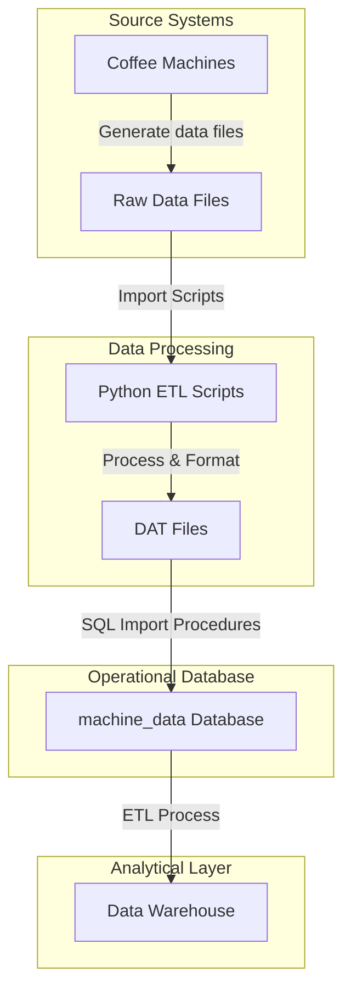

# Machine Data System Overview

## Introduction

The Machine Data system (`machine_data`) is a relational database designed to capture and store operational data from coffee machines. This system serves as the foundation for collecting, processing, and managing the raw operational data before it is transformed and loaded into the data warehouse for analytics.

## Architecture

The system follows a standard relational database model with:

1. **Central Reference Table**: Stores machine identification information
2. **Log Tables**: Store various types of operational events and measurements
3. **Import Procedures**: Process raw data files and load them into the database
4. **Automation**: SQL Server Agent jobs that execute the import procedures on schedule

## System Flow

## Database Schema

The operational database has a straightforward relational design:

### Core Tables

- **machine_names**: Central reference table that stores machine identification
  - `machine_id` (int, PK): Unique identifier for each coffee machine
  - `name` (nvarchar): Descriptive name of the machine

### Log Tables

- **cleaning_logs**: Records cleaning cycles performed by machines
  - Captures start and end times, cleaning status indicators, and detailed measurements
  - Stores temperature, RPM, and cycle data for milk system cleaning on both left and right sides

- **rinse_logs**: Records rinsing operations performed by machines
  - Tracks rinse type, flow rates, and status indicators
  - Stores pump pressure and nozzle performance metrics

- **product_logs**: Records beverage production operations
  - Captures detailed brewing parameters including pressure, grind, and extraction metrics
  - Stores water quantity, temperature, and other product-specific measurements

- **info_logs**: Records information and error messages from machines
  - Stores message numbers, typography, and types
  - Provides diagnostic information for troubleshooting

- **import_log**: Tracks data import operations
  - Records timestamp, message, and error information
  - Helps monitor the ETL process

## Data Import Process

The data import process involves several key components:

### Python Scripts

- **SilverCleaningScript.py**: Processes raw cleaning data
- **SilverRinseScript.py**: Processes raw rinse data
- **SilverProductScript.py**: Processes raw product data
- **SilverInfoScript.py**: Processes raw information and error data
- **ExtractEverysData.py**: Extracts data from source systems
- **DownloadEverysFiles.py**: Downloads data files from machines

### SQL Stored Procedures

- **sp_ImportCleaningLogs**: Parses and imports cleaning log data
- **sp_ImportRinseLogs**: Parses and imports rinse log data
- **sp_ImportProductLogs**: Parses and imports product log data
- **sp_ImportInfoLogs**: Parses and imports information log data
- **sp_ImportRinseLogs_Debug**: Diagnostic procedure for rinse log imports
- **sp_ImportInfoLogs_Debug**: Diagnostic procedure for info log imports

### Import Workflow

Each import procedure follows a consistent pattern:

1. Read raw data from DAT files using xp_cmdshell
2. Parse the data into temporary tables using string manipulation
3. Auto-add any missing machine IDs to the machine_names table
4. Insert only new records to avoid duplication
5. Log the import operation and any errors encountered

## Automated Processes

The system uses SQL Server Agent jobs to automate data imports:

1. **Individual Import Jobs**: Separate jobs for each data type (cleaning, rinse, product, info logs)
   - Each job runs hourly to ensure timely data processing
   - Each job has proper error handling and logging

2. **Master Import Job**: Runs all import procedures in sequence
   - Executes every 6 hours for regular data consolidation
   - Continues processing even if individual steps encounter errors

3. **Database Backup Job**: Performs daily full backups
   - Maintains a 7-day backup history with automatic cleanup
   - Runs at 1:00 AM to minimize system impact

4. **Database Maintenance Job**: Weekly index and statistics maintenance
   - Rebuilds all indexes to ensure optimal performance
   - Updates statistics to improve query plans
   - Runs Sunday at 3:00 AM during lowest usage period

## Key Features

1. **Comprehensive Logging**: Captures all aspects of machine operation
2. **Error Handling**: Robust error trapping and logging in all procedures
3. **Auto-Discovery**: Automatically adds new machines to the reference table
4. **Incremental Loading**: Only processes new records to improve efficiency
5. **Data Validation**: Uses TRY_CAST to safely handle invalid data values
6. **Performance Optimization**: Proper indexing and maintenance routines
7. **Automated Operation**: Scheduled jobs ensure consistent data processing

## Integration Points

The operational database serves as a key integration point in the overall data pipeline:

1. **Source Integration**: Connects to machine data via Python scripts and raw data files
2. **Data Warehouse Integration**: Provides source data for the analytical data warehouse
3. **Monitoring Integration**: Provides operational metrics through SQL Server Agent job history

## Monitoring and Maintenance

The system includes several monitoring and maintenance features:

1. **Import Logging**: Each import procedure logs details about its execution
2. **Error Logging**: Errors are captured in both the import_log table and SQL Server logs
3. **Job History**: SQL Server Agent maintains detailed job execution history
4. **Database Backups**: Daily full backups ensure data can be recovered if needed
5. **Index Maintenance**: Weekly index rebuilds ensure optimal query performance