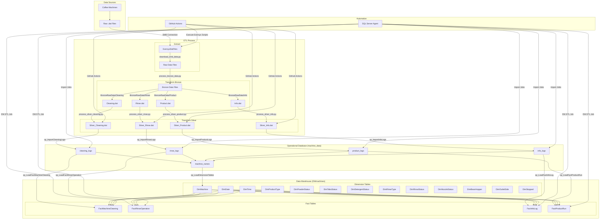

# Machine Data ETL Process Flow

This diagram illustrates the complete data processing pipeline from the source coffee machines to the final data warehouse.

## Process Steps

1. **Data Collection**: Coffee machines generate operational data
2. **Raw Data Extraction**: Python scripts connect to SMB share and download .dat files
3. **Bronze Layer Transformation**: Files are consolidated by category
4. **Silver Layer Transformation**: Data is validated, cleaned, and standardized
5. **Operational Database Loading**: SQL stored procedures import data into relational tables
6. **Data Warehouse ETL**: Dimensional model is populated from operational data
7. **Automation**: GitHub Actions and SQL Server Agent jobs orchestrate the process

## Data Flow Path

1. Coffee Machines → Raw .dat Files → EversysDatFiles
2. EversysDatFiles → BronzeRawData → SilverRawData
3. SilverRawData → machine_data database (Operational)
4. machine_data → DWmachines database (Analytical)

## Automation Components

The process is fully automated through:

1. **GitHub Actions**:
   - "Execute Eversys Scripts" (runs every 30 minutes)
   - "Deploy on VM" (runs on code changes)

2. **SQL Server Agent Jobs**:
   - Individual import jobs for each log type
   - Master import job to run all procedures in sequence
   - Data warehouse ETL job
   - Database backup job

This end-to-end pipeline ensures that data flows from the coffee machines to the analytical data warehouse with minimal manual intervention.