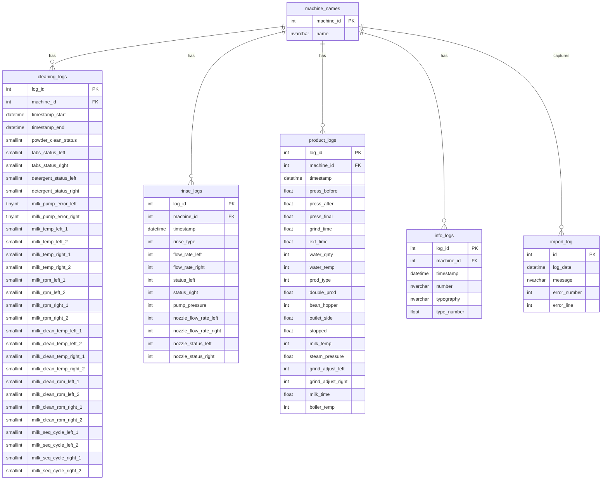

# Machine Data - Relational Database Schema

The relational database schema captures the operational data from coffee machines, with `machine_names` as the central table connected to various log tables.

## Entity-Relationship Diagram

## Table Details

### machine_names
Central table that stores machine identification information.
- **machine_id** (int, PK): Unique identifier for each coffee machine
- **name** (nvarchar(100)): Descriptive name of the machine

### cleaning_logs
Records cleaning cycles performed by machines.
- **log_id** (int, PK): Unique log identifier
- **machine_id** (int, FK): Reference to machine_names
- **timestamp_start** (datetime): When cleaning cycle started
- **timestamp_end** (datetime): When cleaning cycle ended
- Multiple status and measurement fields for cleaning operations

### rinse_logs
Records rinsing operations performed by machines.
- **log_id** (int, PK): Unique log identifier
- **machine_id** (int, FK): Reference to machine_names
- **timestamp** (datetime): When rinsing operation occurred
- Various flow rates, pressures, and status indicators

### product_logs
Records beverage production operations.
- **log_id** (int, PK): Unique log identifier
- **machine_id** (int, FK): Reference to machine_names
- **timestamp** (datetime): When product was made
- Various measurements about pressure, temperature, and grind settings

### info_logs
Records information and error messages from machines.
- **log_id** (int, PK): Unique log identifier
- **machine_id** (int, FK): Reference to machine_names
- **timestamp** (datetime): When message was logged
- Details about the type and content of the message

### import_log
Tracks data import operations.
- **id** (int, PK): Unique log identifier
- **log_date** (datetime): When import operation occurred
- **message** (nvarchar): Operation message
- **error_number** (int): Error code if applicable
- **error_line** (int): Error line if applicable