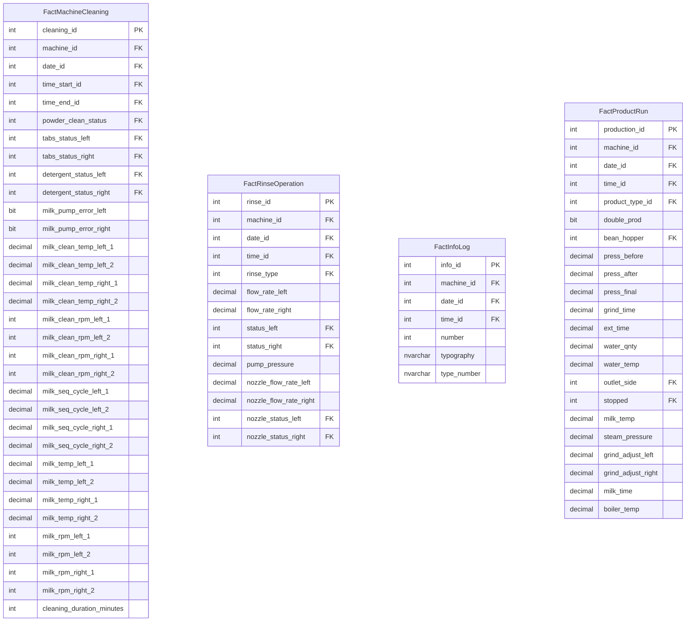

# DWmachines - Data Warehouse Schema

The data warehouse implements a star schema with dimension tables surrounding fact tables. This design optimizes for analytical queries on machine operations.

## Dimension Tables

```mermaid
erDiagram
    DimMachine {
        int machine_id PK
        nvarchar machine_name
        nvarchar machine_type
        date installation_date
        nvarchar manufacturer
        nvarchar model
        nvarchar location
    }

    DimDate {
        int date_id PK
        date full_date
        int day
        int month
        int quarter
        int year
        bit is_weekend
        bit is_holiday
    }

    DimTime {
        int time_id PK
        time full_time
        int hour
        int minute
        int second
        nvarchar am_pm
        nvarchar shift
    }

    DimProductType {
        int product_type_id PK
        nvarchar prod_type
        nvarchar description
    }

    DimPowderStatus {
        int powder_status_id PK
        nvarchar status_name
    }

    DimTabsStatus {
        int tabs_status_id PK
        nvarchar tabs_status_name
    }

    DimDetergentStatus {
        int detergent_status_id PK
        nvarchar detergent_status_name
    }

    DimRinseType {
        int rinse_type_id PK
        nvarchar rinse_type_name
    }

    DimRinseStatus {
        int rinse_status_id PK
        nvarchar rinse_status_name
    }

    DimNozzleStatus {
        int nozzle_status_id PK
        nvarchar nozzle_status_name
    }

    DimBeanHopper {
        int bean_hopper_id PK
        nvarchar bean_hopper_name
    }

    DimOutletSide {
        int outlet_side_id PK
        nvarchar outlet_side_name
    }

    DimStopped {
        int stopped_id PK
        nvarchar stopped_name
    }
```

## Fact Tables

## Star Schema Relationships

```mermaid
erDiagram
    DimMachine ||--o{ FactMachineCleaning : dimensions
    DimMachine ||--o{ FactRinseOperation : dimensions
    DimMachine ||--o{ FactInfoLog : dimensions
    DimMachine ||--o{ FactProductRun : dimensions
    
    DimDate ||--o{ FactMachineCleaning : dimensions
    DimDate ||--o{ FactRinseOperation : dimensions
    DimDate ||--o{ FactInfoLog : dimensions
    DimDate ||--o{ FactProductRun : dimensions
    
    DimTime ||--o{ FactMachineCleaning : start_time
    DimTime ||--o{ FactMachineCleaning : end_time
    DimTime ||--o{ FactRinseOperation : dimensions
    DimTime ||--o{ FactInfoLog : dimensions
    DimTime ||--o{ FactProductRun : dimensions
    
    DimPowderStatus ||--o{ FactMachineCleaning : dimensions
    DimTabsStatus ||--o{ FactMachineCleaning : left_status
    DimTabsStatus ||--o{ FactMachineCleaning : right_status
    DimDetergentStatus ||--o{ FactMachineCleaning : left_status
    DimDetergentStatus ||--o{ FactMachineCleaning : right_status
    
    DimRinseType ||--o{ FactRinseOperation : dimensions
    DimRinseStatus ||--o{ FactRinseOperation : left_status
    DimRinseStatus ||--o{ FactRinseOperation : right_status
    DimNozzleStatus ||--o{ FactRinseOperation : left_status
    DimNozzleStatus ||--o{ FactRinseOperation : right_status
    
    DimProductType ||--o{ FactProductRun : dimensions
    DimBeanHopper ||--o{ FactProductRun : dimensions
    DimOutletSide ||--o{ FactProductRun : dimensions
    DimStopped ||--o{ FactProductRun : dimensions
```

## Schema Design Benefits

1. **Dimensional Model**: The star schema design with dimension tables surrounding fact tables optimizes for analytical queries
2. **Denormalized Structure**: Dimension tables store descriptive attributes, reducing the need for complex joins
3. **Fact Tables**: Central tables store measurements with foreign keys to dimensions
4. **Historical Analysis**: Designed for time-series analysis with date and time dimensions
5. **Query Performance**: Structure enables efficient slicing and dicing of data for reports and dashboards

## ETL Process

The ETL process extracts data from the operational database (`machine_data`), transforms it according to the dimensional model, and loads it into the data warehouse (`DWmachines`).

The process is orchestrated by `sp_LoadDWData_Master`, which calls individual procedures:
1. `sp_EnsureDimensionCompleteness`: Adds any missing dimension values
2. `sp_LoadDimensionTables`: Updates dimension tables with reference data
3. `sp_LoadFactMachineCleaning`: Loads cleaning operation facts
4. `sp_LoadFactRinseOperation`: Loads rinsing operation facts
5. `sp_LoadFactInfoLog`: Loads information log facts
6. `sp_LoadFactProductRun`: Loads product run facts